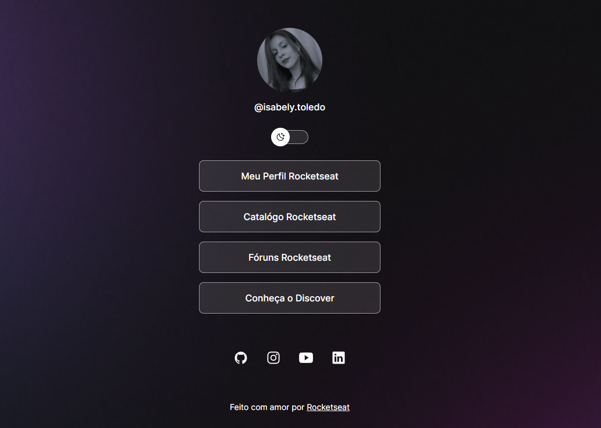

<h1 align="center"> Projeto Discover Rocketseat </h1>

Programa exclusivo e gratuito, promovido pela Rocketseat para ensino de tecnologias WEB.

  <a href="#-tecnologias">Tecnologias</a>&nbsp;&nbsp;&nbsp;|&nbsp;&nbsp;&nbsp;
  <a href="#-projeto">Projeto</a>&nbsp;&nbsp;&nbsp;|&nbsp;&nbsp;&nbsp;
  <a href="#-layout">Layout</a>&nbsp;&nbsp;&nbsp;|&nbsp;&nbsp;&nbsp;
  <a href="#memo-licença">Licença</a>

  

 

  

##  Tecnologias

Esse projeto foi desenvolvido com as seguintes tecnologias:

- HTML e CSS
- JavaScript
- Git e Github
- Figma

## Projeto

O projeto é um agregador de links para usar como cartão de visitas online

[Link] () para visualização o projeto.

## Layout

Você pode visualizar o layout do projeto através [DESSE LINK](https://www.figma.com/file/aZSjJQwha0awnzkn6Q9CPX/DevLinks-%25E2%2580%25A2-Projeto-Discover-(Community)?type=design&node-id=10-620&mode=design). É necessário ter conta no [Figma](https://figma.com) para acessá-lo.

## Licença

Esse projeto está sob a licença MIT.

---

Feito com ♥ by Rocketseat [Participe da nossa comunidade!](https://discord.gg/rocketseat)
